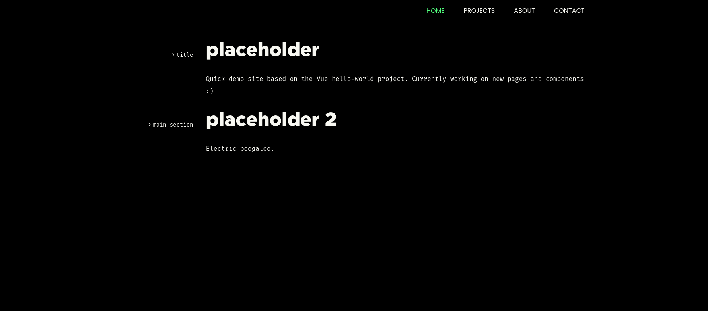

# Portfolio Site

Misc code for my (new & improved) art / development portfolio.

To-do list: <a href="TODO.md">TODO.md</a>

Colour palette: <a href="https://draculatheme.com/">Dracula Theme</a>

Current portfolio: <a href="https://kio.dev/">kio.dev</a>

### Current progress:

# Project setup

I'm using Vue 3, Tailwind.css, and TypeScript.

#### Install deps:

`npm install`

#### Compiles and hot-reloads for development:

`npm run serve`

#### Compiles and minifies for production:

`npm run build`

#### Lints and fixes files

`npm run lint`
